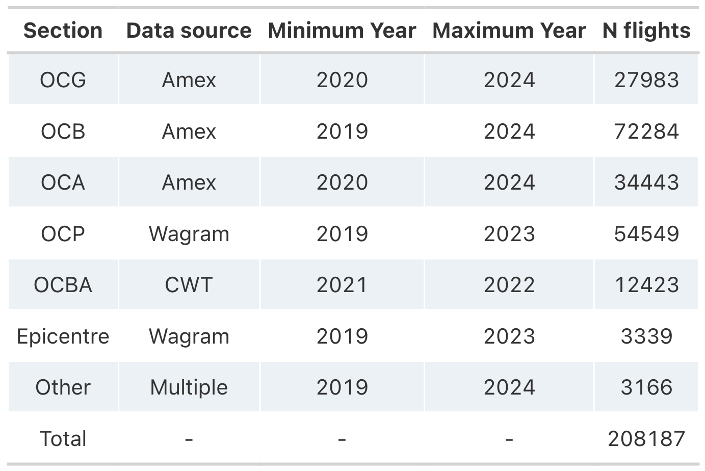

# MSF Carbon Travel App

Welcome to the MSF Carbon Travel App !

This is a multi-function app designed to raise awareness and help minimise the *carbon emissions* caused by travel across the MSF movement.

It is organised in two parts:

1.  The **Meeting Place Planner** helps MSF/EPICENTRE decision makers identify suitable meeting/event locations in order to minimise the *CO2 emissions*.

2.  The **Single Travel Estimation** allows users to estimate the distance and *CO2 emissions* of a specific travel route. This can be done for passenger or freight.

### Project genesis

This project stems from the collaboration between the [Climate Smart MSF](https://msfintl.sharepoint.com/:u:/r/sites/ClimateSmartMSF/SitePages/Main-Page.aspx?csf=1&web=1&e=8t2nc5), a TIC (Transformational Investment capacity) project co-sponsored by MSF Canada and OCG, and the [Data Science Team](https://epicentre-msf.github.io/gallery/) at [Epicentre](https://epicentre.msf.org/).

The goal of the project is to help minimise MSF flight travel emissions by providing a tool that could find the best location to host the many meetings and trainings that the movement organises.

For any general enquiries regarding the project or **Climate Smart MSF** please contact [Maëlle CHARRIER](mailto:Maelle.CHARRIER@geneva.msf.org). For technical enquiries regarding the app, please contact [Hugo SOUBRIER](mailto:hugo.soubrier@epicentre.msf.org) or [Paul CAMPBELL](mailto:paul.campbell@epicentre.msf.org). The code for the app is available on the [Epicentre GitHub](https://github.com/epicentre-msf/carbon-travel-app) where you can also [report an issue](https://github.com/epicentre-msf/carbon-travel-app/issues).

## Data sources

The travel data are gathered from different sources depending on the travel agencies used by MSF entities. These data are cleaned and compiled before visualisations.

{width=600px height=400px}

These data represent about 200 000+ flights, but because these data are not exhaustive, they **do not represent** all flights possibilities between two cities.

## Matrices

We use this dataset to create two networks of cities:

1.  Linking all possible cities together
2.  Linking all cities by the available flights in the dataset.

These networks are then used to generate distance and emissions matrices that can be used throughout the app.

### Distance matrices

1.  The **cities distance matrix** gives the direct, shortest *great-circle distance* (using the Haversine formula, taking into account the curve of the Earth) between all cities of the dataset.

2.  The **flight distance matrix** gives the shortest distance between all cities of the dataset **across the network**. This means that when direct flights are not available in the data, we use the shortest combinations of flights through the network - *this is a limitations as it does not represent the true stop-overs for some travels*.

### Emission matrices

From these distance matrices we can create emissions matrices using emissions factors (see below)

1.  The **cities emissions matrix** gives the direct flight emissions between all cities of the dataset.
2.  The **flight emissions matrix** gives the existing flight emissions. We retrieve each flight segment that links two cities. Each segment of travel is then converted to the corresponding emissions using the emission factors for short, medium and long hauls. The emissions are then summed over all segments to yield the total travel emissions between two cities.

#### Emissions factors

The emission factors used in the analysis are following the common MSF methodology designed by **Climate Smart MSF**. Compared with the emission factors DEFRA, MSF have chosen to use those of ADEME, according to our flight typology. While DEFRA insist on the difference of class (economy/business..), ADEME focus on the haul duration (short/middle/long). More information on the methodology behind carbon emissions can be found on the [Climate Smart MSF website](https://msfintl.sharepoint.com/:u:/r/sites/ClimateSmartMSF/SitePages/Main-Page.aspx?csf=1&web=1&e=8t2nc5).

## Meeting place planner methodology

### Flight only

To accurately calculate the best meeting locations based on participants origins, *considering that everyone would fly to destination*, we use the above distance and emissions matrices.

For one destination, the algorithm queries the corresponding flight distance and emissions for all possible origins, and multiply them by the number of participants from each origin. These are then aggregated to yield the total distance and total emissions for this particular destination given these participants origins. This is then repeated for all possible destinations selected by the user.

### Flight and train alternatives

In the case that a *destination and an origin are both in Europe AND less than 500km apart*, we assume that a train travel could be feasible.

In that case, we recalculate the distance between these cities using a factor of 1.2 (railways are not straight lines and this is considered a good approximation). For all other cities where train is not an option we retain the flight distances. We then use a train emission factor of 0.05/km to estimate the corresponding train trips emissions. As before, all distance and emissions are multiplied by the number of participant doing the trip, and aggregated for one destination, and the process is repeated for all destination selected.

### Ranking

Once all distances and emissions have been retrieved, we rank the possible destinations based on the total emissions from the Plane + Train trips, and only on Plane trips if no train trip are feasible to reach a destination.

## Single Travel Estimation methodology

The **Single Travel Estimator** is meant to be used by user who already know the trip they will do, or have a particular trip in mind. Here, because we assume the trip is known (thus feasible) we use the direct distance and emissions matrices between all cities. Each input segment of the trip is then analysed for distance and emissions before being displayed. The calculation slightly differ whether we consider passenger or freight travel.

### Passengers

When selecting a trip for passenger, two mode of transport can be considered: plane or rails, using the same emission and distance calculations as in the meeting place planner (see above).

### Freight

When selecting a trip for freight, you need to indicate the weight (in tons) of the freight. Then two mode of transport can be considered: plane or truck.

Emissions for plane travel are calculated as **distance (km) \* freight weight (tons) \* 1250**.

For truck transport, we consider longer distances (flight distance \* 1.1) and emissions calculated as: **distance (km) \* freight weight (tons) \* 136** .
